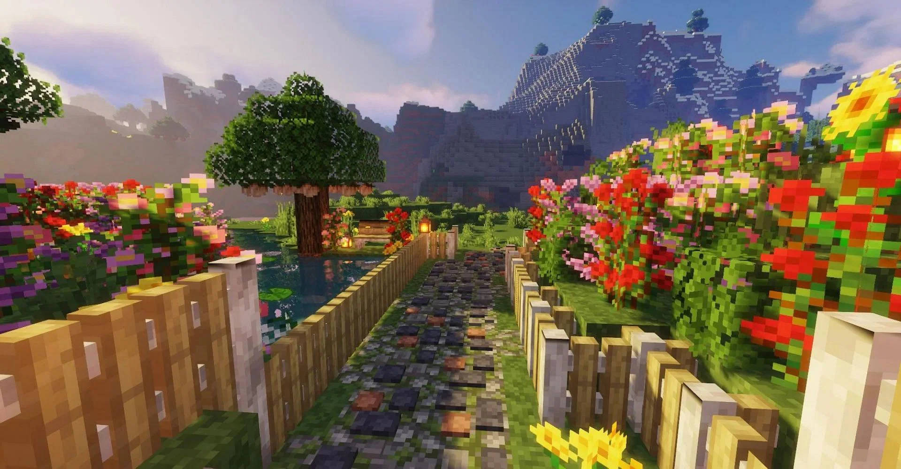

<div align="center">
  
  <h1>AeiloTheme</h1>
  <p><strong>A modern, sleek, and high-performance game server hosting template built with React & Vite.</strong></p>
</div>

---



## 🚀 Features

- **Modern Tech Stack**: Built with React 18, Vite, and Tailwind CSS.
- **Smooth Animations**: Powered by Framer Motion for a dynamic and engaging user experience.
- **Beautiful Icons**: Integrated with Lucide React and custom game icons.
- **Fully Responsive**: Designed to look stunning on mobile, tablet, and desktop screens.
- **Game Server Focused**: Includes tailored pages for Minecraft, game servers, and services.
- **Fast & Optimized**: Leverages Vite for instant server start and lightning-fast Hot Module Replacement (HMR).

## 🛠️ Tech Stack

- **Framework**: [React 18](https://reactjs.org/) + [Vite](https://vitejs.dev/)
- **Styling**: [Tailwind CSS](https://tailwindcss.com/)
- **Routing**: [React Router DOM](https://reactrouter.com/)
- **Animations**: [Framer Motion](https://www.framer.com/motion/)
- **Icons**: [Lucide React](https://lucide.dev/)

## 📂 Project Structure

```text
├── assets/          # Static assets (images, game icons, videos, backgrounds)
├── src/
│   ├── components/  # Reusable UI components (Navbar, Footer, Preloader, BuildMarquee, etc.)
│   ├── pages/       # Application routes (Home, About, Minecraft, Services, Legal)
│   ├── App.jsx      # Main application and routing setup
│   ├── main.jsx     # Application entry point
│   └── index.css    # Global styles and Tailwind directives
├── tailwind.config.js # Tailwind CSS configuration
└── vite.config.js     # Vite configuration
```

## ⚙️ Quick Start

Follow these steps to run the project locally.

### Prerequisites

Ensure you have [Node.js](https://nodejs.org/) installed on your machine.

### Installation

1. **Clone the repository**:
   ```bash
   git clone https://github.com/itsabh4y/aeilotheme.git
   cd "Aeilo - Web"
   ```

2. **Install dependencies**:
   Using npm:
   ```bash
   npm install
   ```

3. **Start the development server**:
   ```bash
   npm run dev
   ```
   Open your browser and navigate to `http://localhost:5173`.

4. **Build for production**:
   ```bash
   npm run build
   ```
   The production-ready files will be generated in the `dist/` directory.

## 🎨 Assets Included

This theme includes custom assets specifically tailored for a hosting company:
- High-quality background imagery (e.g., Minecraft hero background)
- Game framework icons (Java, Fabric, Forge, PaperMC, Purpur, Spigot, Python, etc.)
- Trust badges and brand integration (Trustpilot ratings, Docker, Wumpus)

---

<div align="center">
  <p>Created with ❤️ by <b>itsabh4y</b></p>
</div>
